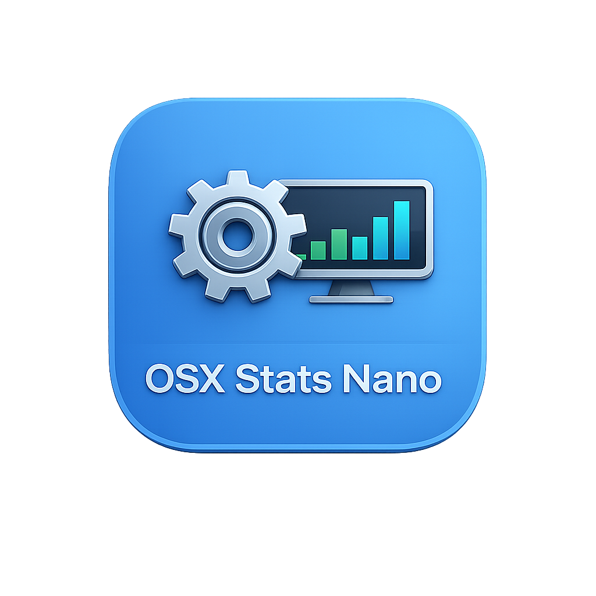
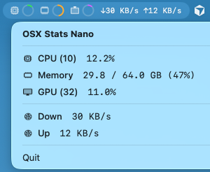

# OSX Stats Nano

An ultra-light macOS menu bar system monitor. Pure AppKit, zero dependencies, 180 KB binary, ~1,100 lines of Swift.


[](https://github.com/hefeicoder/osx_stats_nano/releases/latest)

## What it does

Displays live **CPU**, **Memory**, **GPU**, and **Network** stats in your menu bar with minimal resource usage.



- **CPU** — ring gauge (green)
- **Memory** — ring gauge (orange)
- **GPU** — ring gauge (purple, hidden if unavailable)
- **Network** — ↓/↑ throughput text

Click the menu bar item for a detailed breakdown with core counts and live-updating values.

## Why another stats app?

Most menu bar monitors are bloated — SwiftUI, Combine, third-party charting libraries, 30–100 MB of RAM just to show you a number. OSX Stats Nano is built on one principle: **the monitor should never be the thing slowing you down.**

- **Pure AppKit, zero dependencies** — no SwiftUI, no Combine, nothing beyond Apple system frameworks
- **Zero-alloc draw path** — widgets draw directly to `CGContext`; SF Symbol icons cached at init, not every frame
- **Change detection** — skips all redraws when your system is idle; silent when nothing changes
- **Per-monitor polling** — each metric polls on its own interval; GPU can be slow, network can be fast
- **180 KB binary, ~1,100 lines of Swift** — small enough to read in an afternoon, easy to audit, easy to trust

## Install

**Download (recommended):**

1. Download `OSXStatsNano-x.x.x.dmg` from [Releases](https://github.com/hefeicoder/osx_stats_nano/releases/latest)
2. Open the DMG and drag **OSXStatsNano** into Applications
3. **First launch:** macOS will block the app since it is not notarized. To open it:
   - Run in Terminal: `xattr -d com.apple.quarantine /Applications/OSXStatsNano.app`, or
   - Go to **System Settings → Privacy & Security**, scroll down to find _"OSXStatsNano was blocked"_, and click **Open Anyway**

   > **Note:** On macOS Ventura+, double-clicking shows a "Move to Trash / Done" dialog with no Open option — dismiss it with **Done**, then follow the Privacy & Security steps above.

**Build from source:**

```bash
git clone https://github.com/hefeicoder/osx_stats_nano.git
cd osx_stats_nano
./run.sh
```

Requires **macOS 13+** and **Xcode**.

## Configuration

On first launch, a config file is created at `~/.config/osx-stats-nano/config.yaml`. Edit and restart the app to apply changes.

```yaml
# ── Polling intervals (seconds) ─────────────────
# Minimum: 0.5s (gpu minimum: 1.0s)
# GPU uses IOKit which is heavier — 6s recommended.

cpu_interval: 2.0      # default: 2.0
memory_interval: 2.0   # default: 2.0
gpu_interval: 6.0      # default: 6.0
network_interval: 2.0  # default: 2.0

# ── Visibility ───────────────────────────────────
# Options: true | false

show_cpu: true         # default: true
show_memory: true      # default: true
show_gpu: true         # default: true
show_network: true     # default: true

# ── Widget style ─────────────────────────────────
# Options: circle | bar | vbar

cpu_style: circle      # default: circle
memory_style: circle   # default: circle
gpu_style: circle      # default: circle

# ── Widget color ─────────────────────────────────
# Options: green | orange | blue | red | purple | yellow | pink | teal

cpu_color: green       # default: green
memory_color: orange   # default: orange
gpu_color: purple      # default: purple

# ── Icons (SF Symbol names) ──────────────────────
# Browse at: developer.apple.com/sf-symbols
# cpu:     cpu | cpu.fill | bolt | bolt.fill
# memory:  memorychip | memorychip.fill
# gpu:     display | display.fill | rectangle.3.group
# network: network | wifi | antenna.radiowaves.left.and.right

cpu_icon: cpu
memory_icon: memorychip
gpu_icon: display
network_icon: network
```

## Architecture

```
Monitors (system calls)  →  StatsPoller (background timer)  →  StatsSnapshot (cache)  →  Display (widgets)
```

| Layer | What it does |
|-------|-------------|
| **Monitors** | Thin wrappers around Mach (`host_processor_info`, `host_statistics64`), BSD (`getifaddrs`), and IOKit (`IOAccelerator`) |
| **StatsPoller** | Single `DispatchSourceTimer` on a utility queue; each monitor fires on its own interval |
| **StatsSnapshot** | Immutable value type with `isDifferent()` — 1% threshold for CPU/Mem/GPU, 1 KB/s for network |
| **StatusBarView** | Custom `NSView` on the `NSStatusItem` button; rebuilds widget list once per update, `draw()` is zero-alloc |
| **StatsDetailView** | Pure AppKit `NSStackView` — built lazily via `NSMenuDelegate.menuWillOpen`, only on click |

## Project Structure

```
Sources/
├── main.swift                    # Entry point
├── AppDelegate.swift             # Lifecycle, wires poller → display
├── AppConfig.swift               # YAML config loader (no dependencies)
├── StatsPoller.swift             # Background polling with per-monitor intervals
├── StatsSnapshot.swift           # Immutable cache with change detection
├── StatusBarController.swift     # NSStatusItem + custom NSView
├── Monitors/
│   ├── CPUMonitor.swift          # Mach host_processor_info
│   ├── MemoryMonitor.swift       # Mach host_statistics64
│   ├── GPUMonitor.swift          # IOKit IOAccelerator
│   └── NetworkMonitor.swift      # BSD getifaddrs
├── Widgets/
│   ├── StatusBarWidget.swift        # Protocol
│   ├── PercentageBarWidget.swift    # Horizontal bar
│   ├── PercentageCircleWidget.swift # Ring gauge
│   ├── VerticalBarWidget.swift      # Vertical bar
│   ├── NetworkWidget.swift          # Stacked ↓/↑ network
│   └── TextWidget.swift             # Plain text
└── Views/
    └── StatsDetailView.swift     # Dropdown detail panel
```

## License

MIT — see [LICENSE](LICENSE).
